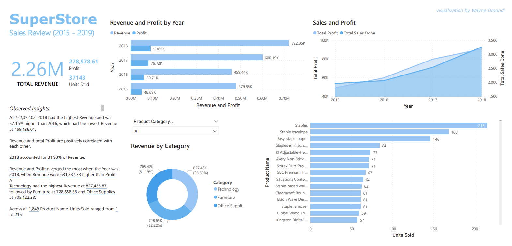

# StoreSales_Analysis
SuperStore Sales Dataset EDA and Visualization using Python. 
Going through the data processing, cleaning and handling any missing values. Before exploring the sales and performance of the store, querying the dataset and visualizing the fiding.

-  libraries used in "requirements.txt" file.
-  clone the python environment using "environment.yml" file.

A [Dashboard](https://github.com/WayneNyariroh/StoreSales_PowerBI_Dashboard) for the project is also available.

